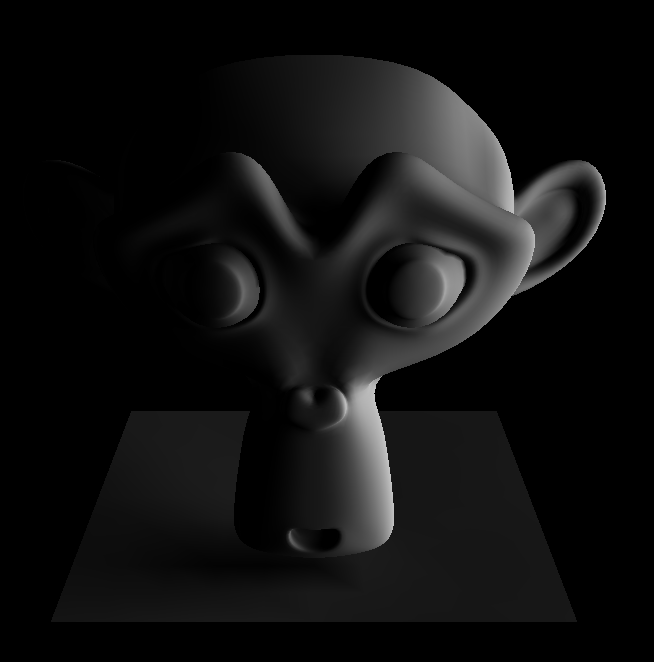
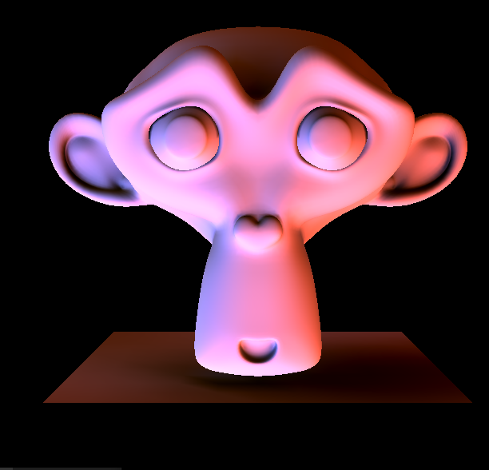
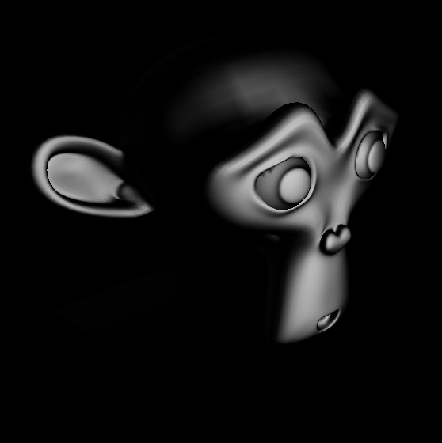
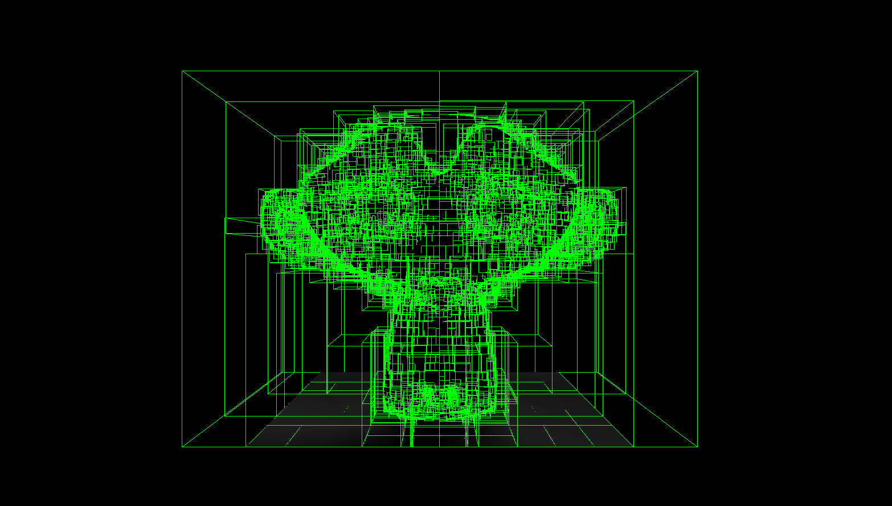
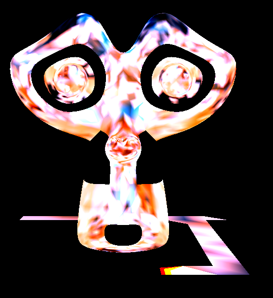
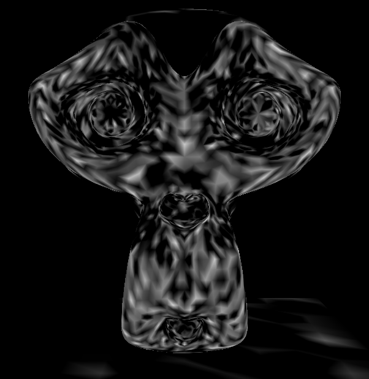

# Spherical Harmonic Lighting

An experimental project to explore global illumination techniques that use Spherical Harmonics.

### Features
* Radiance is calulcated per vertex. The transfer function takes into account the surface normal for direct diffuse lighting. It also takes into account indirect shadowing. This is achieved by performing a raytracing precalculation step.
* Glossy BDRF support.
* Raytracing is accelerated using a KD Tree.
* Spherical Harmonic coefficients can be efficiently rotated using recurrence relations as described in a paper by Ivanic.
* Lighting is performed on the GPU. The Spherical Harmonic coefficients are stored in a Texture Buffer Object.
* The engine supports two different types of Light. The first is a simple directional light, the calculation of which is fully synthetic. The second is a probe light, which is based on a provided light probe image, such as those found at <http://www.pauldebevec.com/Probes>.

### Images

# Default Diffuse Lighting
Note the soft shadow being cast from the monkey head onto the ground.

# HDR Probe Diffuse Lighting
Rendered using the Grace Cathedral light probe.

# Default Glossy Lighting

# HDR Probe Glossy Lighting
Rendered using the Grace Cathedral light probe.

# KD Tree
A debug rendering of the KD Tree structure used to raytrace the monkey head mesh.

# Glitches
Because the SH transfer coefficients are calulcated per-vertex, interesting patterns can arise when these coefficients are fed incorrectly to the Vertex Shader:

### Building
The project should work out of the box with Visual Studio 2017 or above.

### References
* Green - [Spherical Harmonic Lighting: The Gritty Details](http://silviojemma.com/public/papers/lighting/spherical-harmonic-lighting.pdf).
* Sloan et al. - [Precomputed Radiance Transfer for Real-Time Rendering in Dynamic, Low-Frequency Lighting Environments](https://sites.fas.harvard.edu/~cs278/papers/prt.pdf).
* Sloan - [Stupid Spherical Harmonics (SH) Tricks](http://www.ppsloan.org/publications/StupidSH36.pdf).
* Ivanic et al. - [Rotation Matrices
for Real Spherical Harmonics. Direct Determination by Recursion](https://pubs.acs.org/doi/pdfplus/10.1021/jp9833350). **NOTE: even though this is the errata, it still contains an error in the equation for V when m < 0! The correct equation is implemented in `SHRotation.cpp`!**
* Ramamoorthi & Hanrahan - [An Efficient Representation for Irradiance Environment Maps](https://cseweb.ucsd.edu/~ravir/papers/envmap/envmap.pdf).
